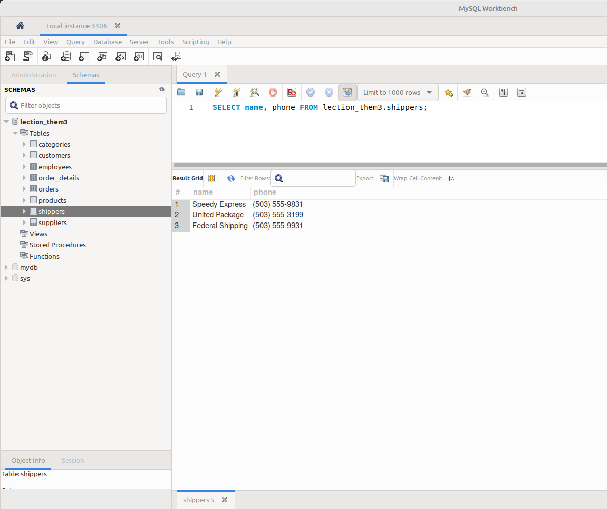

# goit-rdb-hw-03

SQL запити:

### Завдання 1:

> "Напишіть SQL команду, за допомогою якої можна:
>
> - вибрати всі стовпчики (За допомогою wildcard "\*") з таблиці products;
> - вибрати тільки стовпчики name, phone з таблиці shippers"

---

```sql
SELECT * FROM lection_them3.products;
```


_p1_all_data_products.png_

---

```sql
SELECT name, phone FROM lection_them3.shippers;
```


_p1_query_to_shippers.png_

---

### Завдання 2:

> Напишіть SQL команду, за допомогою якої можна знайти середнє, максимальне та мінімальне значення стовпчика price таблички products

---

```sql
-- AVG
SELECT AVG(price) AS average_price FROM lection_them3.products;
```


_p2_average_price.png_

---

```sql
-- MAX
SELECT MAX(price) AS max_price FROM lection_them3.products;
```


_p2_max_price.png_

---

- ```sql
  -- MIN
  SELECT MIN(price) AS min_price FROM lection_them3.products;
  ```
  
  _p2_min_price.png_

### Завдання 3:

- > Напишіть SQL команду, за допомогою якої можна обрати унікальні значення колонок category_id та price таблиці products. Оберіть порядок виведення на екран за спаданням значення price та виберіть тільки 10 рядків.

- ```sql
  SELECT DISTINCT
      category_id, price
  FROM
      lection_them3.products
  ORDER BY price
  LIMIT 10;
  ```

- **Screenshot:**

  - p3_distinct_price.png

    

### Завдання 4:

- > Напишіть SQL команду, за допомогою якої можна знайти кількість продуктів (рядків), які знаходиться в цінових межах від 20 до 100.

- ```sql
  SELECT
    COUNT(*) AS products_count
  FROM
      lection_them3.products
  WHERE
      price > 20 AND price < 100;
  ```

- **Screenshot:**
  - p4_products_count.png

### Завдання 5:

- > Напишіть SQL команду, за допомогою якої можна знайти кількість продуктів (рядків) та середню ціну (price) у кожного постачальника (supplier_id).

- ```sql

  ```

- **Screenshot:** p5\_
